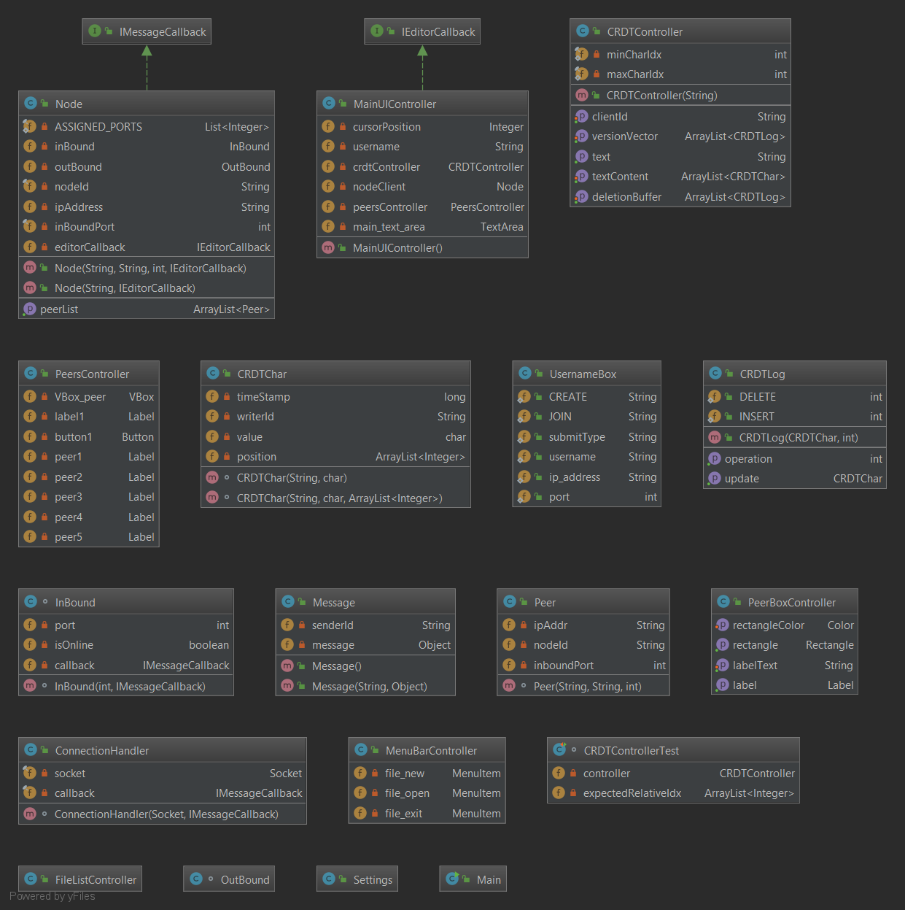

# Petunjuk Penggunaan Program
Asumsi:
* Pengguna telah mempunyai minimal Java 1.8 di dalam sistem operasi nya.

Langkah Menjalankan Program:
1. Melakukan *clone* atau mengunduh zip dari repositori ini (jika mengunduh zip, lakukan ekstraksi dari zip yang telah diunduh)
2. Membuka folder hasil *clone* atau ekstraksi.
3. Membuka folder out
4. Menjalankan aplikasi *peer2peer-collaborative-editing.jar* dengan menekan ikon aplikasi sebanyak 2 kali secara cepat.
5. Memasukkan nama dan memilih *Create* pada Radio button, lalu menekan OK
6. Menjalankan aplikasi *peer2peer-collaborative-editing.jar* lainnya dengan menekan ikon aplikasi sebanyak 2 kali secara cepat.
7. Memasukkan nama dan memilih *Join* pada Radio button.
8. Memasukkan alamat IP dan Port pada *Text field* berdasarkan alamat IP dan Port yang ditampilkan oleh program sebelumnya
9. Mengetik tulisan pada *Text Area* untuk melihat CRDT program.

# Pembagian Tugas

|          Nama          |    NIM   |  Persentase | Deskripsi |
| ---------------------- | -------- | ----------- | --------- |
| Shandy                 | 13516097 | XX%         | UI, Controller, deletion buffer, Laporan     |
| Jessin D.              | 13516112 | XX%         | CRDT, Version Vector                         |
| I Kadek Yuda B. G.     | 13516115 | XX%         | Messenger, Peer2Peer, laporan                |

# Laporan

## Deskripsi Program
### Cara Kerja Program
Program akan menampilkan sebuah tampilan antarmuka berisi text editor dan daftar username dari program-program lain yang
telah terkoneksi. Setiap masukan pengguna ke dalam text editor akan diterima oleh **MainUIController** dan dilanjutkan dengan 
memanggil fungsi localInsert dari kelas **CDRTController** yang akan memperbaharui struktur **CDRT** serta men-*trigger* 
kelas **Messenger** untuk mengirimkan masukan pengguna tersebut ke program-program lain.

Pemrosesan kiriman akan berbeda sesuai dengan jenis perintah dari kiriman tersebut. Jika perintah kiriman yakni melakukan 
penambahan karakter pada text editor maka program penerima akan menerima kiriman tersebut dan menverifikasikannya dengan 
kelas **Version Vector** yang dimiliki. Jika verifikasi berhasil, maka karakter dari kiriman tersebut akan ditampilkan ke *text editor*.
Akan tetapi, jika perintah kiriman yakni melakukan penghapusan karakter pada *text editor*, program menerima akan memasukkannya ke dalam
sebuah ***deletion buffer***. Deletion buffer akan diproses jika program menerima kiriman dari program lain untuk di cek jika
karakter yang bersangkutan pernah ditambahkan ke text editor dan jika pernah, karakter tersebut akan dihapus.

Setiap peer dalam sistem ini berkomunikasi dengan sistem jaringan ***Peer To Peer*** yang bertindak sebagai ***Messenger*** sekaligus
penerima koneksi baru. Apabila suatu peer (client) ingin masuk ke dalam sistem, maka peer tersebut harus menyambungkan dirinya dengan 
salah satu peer yang sudah terhubung untuk ikut dalam jaringan dan mendapatkan isi dari editor sebelum peer tersebut masuk.
Jika peer sudah terhubung, maka komunikasi antar peer dapat dilakukan dengan melakukan penukaran data CRDTLog untuk mensinkronisasi
perubahan yang terjadi pada tiap peer;

## Arsitektur Program
Arsitektur program terbagi menjadi dua bagian besar, yakni **Frontend** dan **Backend**.
Frontend mengelola tampilan antarmuka serta menerima masukan dari pengguna. Selain itu, frontend juga melakukan pembaharuan
(*update*) setiap masuknya informasi dari program lain sedangkan Backend mengatur pemrosesan informasi di belakang layar.
Backend mengatur struktur data program melalui *package* **CRDT**, mengelola koneksi program dengan program lain melalui
*package* **P2PServer** dan mengatur perubahan antarmuka melalui *package* UI.

### *Class Diagram*
Berikut adalah *Class Diagram* program:

## Aplikasi CRDT, Version Vector, dan Deletion Buffer
### Struktur Data
Pada program ini, **CRDT** adalah sebuah *package* yang berisi kelas CRDTChar, kelas CRDTController, dan kelas CRDTLog. 
Sedangkan ***Version Vector*** dan ***Deletion Buffer*** menjadi *Member Variables* dari kelas
CDRTController dalam bentuk ArrayList ber-elemen CRDTLog.

### Fungsi
Aplikasi CRDT pada program ini yakni **CRDTChar** sebagai tipe data yang akan direplikasikan pada
komputer-komputer di dalam jaringan, kelas **CRDTController** berfungsi mengatur struktur data dari kumpulan CRDTChar, dan kelas
CRDTLog sebagai entri log dari setiap operasi yang dilakukan secara lokal ataupun *remote*.

Aplikasi **Version Vector** pada program ini yakni menyimpan log yang berisi operasi-operasi yang pernah dilakukan 
terhadap file yang sedang dibuka sehingga operasi LocalInsert, LocalDelete, RemoteInsert, dan Remote Delete
akan menambahkan sebuah entri log pada **Version Vector**. Selain itu, isi dari **Version Vector** juga akan diperiksa
setiap kali operasi RemoteDelete dari *Deletion Buffer* akan dieksekusi. Jika RemoteDelete akan menghapus CRDTChar yang pernah
ditambahkan maka operasi akan berjalan hingga sukses. Akan tetapi, jika CRDTChar yang diinnginkan tidak ditemukan, maka
operasi RemoteControl tersebut akan diabaikan.

Aplikasi **Deletion Buffer** pada program ini yakni menyimpan operasi-operasi RemoteDelete yang sedang dalam keadaan *pending*.
Program akan mengeksekusi RemoteDelete dari Deletion Buffer secara FIFO (First In First Out) selayaknya antrian.
RemoteDelete yang akan dieksekusi hanyalah RemoteDelete yang akan menghapus CRDT yang pernah di-*insert* ke file.
 

## Analisis Program
Analisa yang dapat dibuat berdasarkan program yang telah dikembangkan yakni kurangnya fitur editor pada program.
Tidak adanya *remote cursors* pada *text area* sehingga pengguna tidak mengetahui posisi caret pengguna lain. Selain itu,
*text area* juga belum mendukung fitur-fitur editor seperti *cut*, *copy*, *paste*, dan lain-lain.

## Pengujian
### Kasus *Konkuren Editing*
Kasus Pengujian:
1. Pengguna 1 dan Pengguna 2 melakukan *insert* karakter di posisi *cursor* yang berbeda secara bersamaan.
2. Pengguna 1 dan Pengguna 2 melakukan *delete* karakter di posisi *cursor* yang berbeda.
3. Pengguna 1 dan Pengguna 2 melakukan *insert* karakter di posisi *cursor* yang sama.
4. Pengguna 1 dan Pengguna 2 melakukan *delete* karakter di posisi *cursor* yang sama.

Hasil Pengujian:
TBD

### Kasus Konsistensi
Kasus Pengujian:

Hasil Pengujian:
TBD

### Kasus *Deletion Buffer*
Kasus Pengujian:

Hasil Pengujian:
TBD

### Kasus *Version Vector*
Kasus Pengujian:

Hasil Pengujian:
TBD

## Screenshot
// Gambar Screenshot (Masukkan ke dalam repo ini aja gambarnya)
